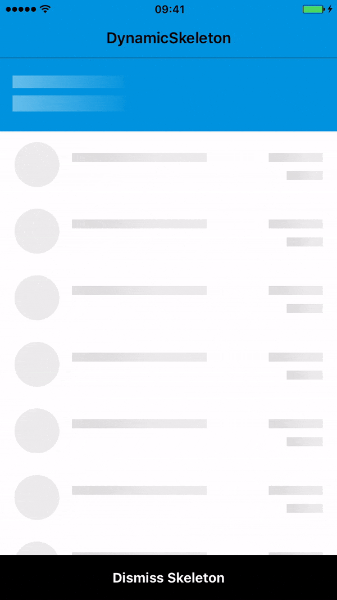

# MPDynamicSkeleton

[](https://travis-ci.org/FedericoBF/MPDynamicSkeleton)
[](http://cocoapods.org/pods/MPDynamicSkeleton)
[](http://cocoapods.org/pods/MPDynamicSkeleton)
[](http://cocoapods.org/pods/MPDynamicSkeleton)

## Description
A modularized skeleton with gradient animation - iOS (Swift/Objective-C)

## Preview


## Usage

#### 1. Import MPDynamicSkeleton in your .Podfile

```ruby
pod "MPDynamicSkeleton"
```
Then run `pod install`

#### 2. Import MPDynamicSkeleton in your swift or Objective-C file:
```ruby
Swift:
import DynamicSkeleton

Objective-C:
@import DynamicSkeleton;
```

#### 3. Code examples
Swift:

```ruby
let headerView = UINib(nibName: "HeaderView", bundle: Bundle.main)
let rowView = UINib(nibName: "RowView", bundle: Bundle.main)
let exitView = UINib(nibName: "ExitView", bundle: Bundle.main)

let containers = [
    DynamicSkeletonModel(view: headerView, repeating: 1, left: 0, right: 0, top: 0, height: 82),
    DynamicSkeletonModel(view: rowView, repeating: 0, left: 0, right: 0, top: 82, bottom: 50, height: 74),
    DynamicSkeletonModel(view: exitView, repeating: 1, left: 0, right: 0, bottom: 0, height: 50)
]

DynamicSkeleton.sharedInstance.presentSkeleton(view: self.view, models: containers)
```

Objective-C
```ruby
UINib *headerView = [UINib nibWithNibName:@"HeaderView" bundle:[[NSBundle mainBundle] bundleIdentifier]];
UINib *rowView = [UINib nibWithNibName:@"RowView" bundle:[[NSBundle mainBundle] bundleIdentifier]];
UINib *exitView = [UINib nibWithNibName:@"ExitView" bundle:[[NSBundle mainBundle] bundleIdentifier]];

DynamicSkeletonModel *header = [[DynamicSkeletonModel alloc] initWithView:headerView repeating:1 left:0 right:0 top:0 height:82];
DynamicSkeletonModel *rows = [[DynamicSkeletonModel alloc] initWithView:rowView repeating:0 left:0 right:0 top:82 bottom:50 height:74];
DynamicSkeletonModel *exit = [[DynamicSkeletonModel alloc] initWithView:exitView repeating:1 left:0 right:0 bottom:0 height:50];

[DynamicSkeleton.sharedInstance presentSkeletonWithView:self.view models:[[NSArray alloc] initWithObjects:header, rows, exit, nil]];
```

## Installation
MPDynamicSkeleton is available through [CocoaPods](http://cocoapods.org). To install
it, simply add the following line to your Podfile:

## Author
MarceloJoseML, marcelo.jose@mercadolibre.com

## License
MPDynamicSkeleton is available under the MIT license. See the LICENSE file for more info.
